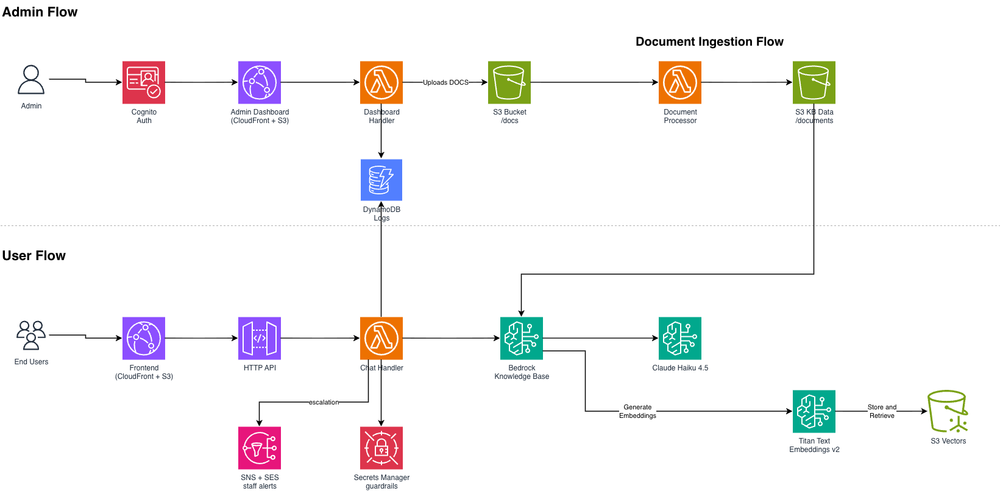

# Project Completion Documentation

## Grand Canyon Council Scout AI

**Client:** Scouting America, Grand Canyon Council (GCC)

**Delivery team:** Arizona State University Cloud Innovation Center

**Documentation snapshot:** July 15, 2026

**Repository:** [ASUCICREPO/scouting-america-gcc](https://github.com/ASUCICREPO/scouting-america-gcc)

This document records the scope and implementation present in the repository at the documentation snapshot. Final organizational acceptance, stakeholder rosters, and operational ownership remain governed by the client handoff process.

## Table Of Contents

- [1. Executive Summary](#1-executive-summary)
- [2. Project Overview](#2-project-overview)
- [3. Project Performance](#3-project-performance)
- [4. Development](#4-development)
- [5. Challenges And Resolutions](#5-challenges-and-resolutions)
- [6. Operational Handoff](#6-operational-handoff)
- [7. Future Scope](#7-future-scope)
- [8. Appendix](#8-appendix)

## 1. Executive Summary

Grand Canyon Council supports thousands of Scouting volunteers, families, and staff across programs, camps, training, advancement, safety, recruitment, and unit operations. Relevant information is distributed across many council and Scouting America documents, making it difficult to find a reliable answer quickly.

The project delivered Scout AI, a responsive bilingual English/Spanish web application grounded in approved GCC and Scouting America content. The public experience lets users ask questions, review structured answers and sources, use voice features, rate responses, and return to saved sessions. The protected admin dashboard gives GCC staff usage and quality metrics, rated-conversation review, and document ingestion management.

The solution runs as serverless AWS infrastructure defined in CDK. A static Next.js application is delivered through CloudFront; API Gateway and Python Lambda handlers serve chat and admin requests; Amazon Bedrock provides retrieval-augmented generation; S3 Vectors stores embeddings; S3 and DynamoDB persist content and operational data; Cognito protects admin workflows; and SNS/SES route escalation notifications.

The delivered pilot reduces the time required to locate council information, gives administrators evidence about common questions and answer quality, and establishes a maintainable document-to-knowledge-base pipeline. It remains an informational assistant, not a replacement for official policy, required training, professional judgment, or emergency and safeguarding channels.

## 2. Project Overview

### 2.1 Stakeholders And Contributors

The repository does not contain an authoritative named roster for GCC product owners or AWS program leads. Those names should remain in the client-controlled handoff record rather than be inferred in source documentation.

Repository contribution history identifies these ASU CIC contributors:

| Contributor | Repository evidence of contribution |
| --- | --- |
| Sreeram Sreedhar | Stack integration, infrastructure hardening, dashboard consolidation, deployment workflow, routing, bilingual integration, and documentation |
| Advait Kankati | Core backend and knowledge-base work, frontend UX, voice features, dashboard features, testing, and deployment fixes |
| Vidhi Patel | Initial backend chat/escalation implementation and Next.js frontend foundation |

GCC stakeholders own content approval, user acceptance, operating policies, escalation contacts, and production-readiness decisions. AWS/ASU CIC advisors support architecture and delivery guidance through the program handoff process.

### 2.2 Timeline

Repository history spans May 29, 2026 through July 15, 2026 for the implementation summarized here.

| Phase | Date range | Outcomes |
| --- | --- | --- |
| Foundation | May 29 - June 4 | Repository scaffold, shared AWS resources, API Gateway, chat, document processing, analytics, and escalation constructs |
| Knowledge base stabilization | June 7 - June 12 | S3 Vectors adoption, vector metadata fixes, Claude Haiku 4.5, PWA frontend, and Bedrock-native document parsing |
| Retrieval and accessibility | June 19 - June 22 | Real retrieval scores, frontend hosting, bilingual/voice experiments, and infrastructure integration |
| Product integration | July 1 - July 8 | Semantic chunking, redesigned chat UI, public chat, authenticated dashboard, settings, feedback, and codebase consolidation |
| Deployment alignment | July 10 - July 12 | Python 3.13 Lambda migration, stack rename, one-step deployment, CodeBuild definition, routing, and voice polish |
| Handoff stabilization | July 14 - July 15 | Folder uploads, ingestion states, feedback transcripts, PWA fixes, shared bilingual support, UI fixes, and completed documentation |

### 2.3 Delivery Approach

Work progressed through focused branches and pull requests, with CDK assertions, Python contract tests, frontend lint/build validation, and live environment verification applied according to change risk. The Cincinnati Museum Chatbot informed documentation organization and the shared bilingual-state pattern, while the GCC implementation retained its own architecture, content domain, APIs, and deployment model.

## 3. Project Performance

### 3.1 Problem Statement

GCC volunteers and families need timely answers across a large and changing collection of official resources. Manual navigation across documents can be slow, terminology varies by program, and users may not know the title of the form or publication they need. Staff also need visibility into common questions, inaccurate answers, low-confidence retrieval, and content gaps.

A useful solution needed to:

- Retrieve from approved GCC and Scouting America content rather than an unrestricted model response alone.
- Serve users without requiring a public account.
- Support English and Spanish across both interface and generated answers.
- Make sources and AI limitations visible.
- Escalate safety wording and uncertain results without claiming to replace human response channels.
- Give administrators protected analytics and content-management tools.
- Minimize idle infrastructure cost and operational burden.

### 3.2 In Scope

- Responsive public web chatbot and installable PWA behavior
- Retrieval-augmented English/Spanish answers
- Markdown rendering and source URI extraction
- Browser speech recognition and speech synthesis where supported
- Browser-local session list and server-side history retrieval
- Per-response positive/negative feedback
- Confidence calculation from Bedrock retrieval scores
- Safety-keyword and low-confidence escalation through SNS/SES
- Cognito-protected dashboard and admin-group authorization
- Usage, feedback, confidence, FAQ, and escalation metrics
- Full-session review for rated responses
- Multi-file/folder document upload with preserved paths
- Document list, download, deletion, and ingestion-state display
- Bedrock-native parsing and semantic chunking
- Prefix-aware CDK resources and one-step deployment
- Static frontend hosting on private S3 through CloudFront
- Developer, operator, API, architecture, user, modification, and closure documentation

### 3.3 Out Of Scope

- Emergency, safeguarding, medical, or legal case intake
- Automated action on behalf of a unit, volunteer, or family
- Ticketing, registration, payment, or reservation transactions
- Public user accounts and cross-device personal chat history
- A content-authoring workflow inside the dashboard
- Custom domain, enterprise SSO, or external identity federation
- Production WAF, centralized alarms, distributed tracing, and full access logging
- Formal records retention, legal discovery, or deletion-request automation
- Guaranteed translation or human linguistic review for every generated response
- Native iOS or Android applications

### 3.4 Deliverables

| Deliverable | Status | Location |
| --- | --- | --- |
| Public Scout AI web application | Delivered | `frontend/app/page.tsx`, `frontend/components/` |
| English/Spanish shared interface | Delivered | `frontend/context/LanguageContext.tsx`, `frontend/lib/i18n.ts` |
| Protected admin dashboard | Delivered | `frontend/app/dashboard/`, `backend/lambda/dashboard/` |
| Public and admin APIs | Delivered | `backend/lib/constructs/`, `backend/lambda/` |
| Bedrock Knowledge Base and ingestion pipeline | Delivered | `knowledge-base.ts`, `doc-processor` |
| Analytics, feedback, and escalation data | Delivered | DynamoDB resources and Lambda handlers |
| AWS infrastructure as code | Delivered | `backend/lib/`, `backend/bin/` |
| End-to-end deployment script | Delivered | `deploy.sh` |
| CodeBuild backend workflow | Delivered | `buildspec.yml` |
| CDK and bilingual contract tests | Delivered | `backend/test/` |
| Handoff documentation | Delivered | `README.md`, `docs/` |

## 4. Development

### 4.1 Users And Experience

#### Primary Users

- GCC volunteers and unit leaders seeking program, policy, training, advancement, camp, safety, recruitment, or planning information
- Parents and families looking for council and program guidance
- GCC administrators monitoring usage and response quality
- Content administrators maintaining the approved document corpus

#### User Goals

Public users want a direct, conversational path to the right information without knowing the source document's title or navigation path. Administrators want to see what is being asked, identify poor or uncertain answers, inspect context, and update the corpus without using the AWS console for routine file operations.

#### Experience Delivered

The public interface provides suggested prompts, free-text and voice input, structured responses, feedback controls, saved sessions, FAQ/settings views, dark mode, adjustable text, and mobile/desktop layouts. The English/Spanish control is located in Settings under Appearance and is shared with the admin application.

The dashboard provides a dense operational layout with overview metrics, trend and FAQ data, rated-conversation review, document management, appearance settings, and authenticated logout behavior.

### 4.2 System Architecture

The frontend is built once as a static Next.js export and published to a private S3 bucket. CloudFront serves it over HTTPS and rewrites nested application routes. Public chat and protected administration use separate API Gateway REST APIs.

The chat handler retrieves grounded context and generates answers through a Bedrock Knowledge Base. The knowledge base uses Titan Text Embeddings v2 and S3 Vectors. Chat turns and feedback are persisted in DynamoDB. Escalations are routed asynchronously to SNS, optionally SES for high-severity safety matches, and the analytics table.

Administrators upload directly to S3 with short-lived, batch-bound presigned POST policies. S3 events enter a bounded validation/copy queue; accepted objects preserve their nested paths, rejected objects move to a private seven-day quarantine, and a separate FIFO queue serializes Bedrock ingestion.

See the [Architecture Deep Dive](./architectureDeepDive.md) for exact services, data models, controls, decisions, and limitations.

### 4.3 Technology Stack

#### Frontend

- Next.js 16 and React 19
- TypeScript and App Router
- React Markdown with GitHub-flavored Markdown
- Lucide React icons and Sonner notifications
- Static export to S3/CloudFront
- Browser Web Speech APIs where supported

#### Backend And Infrastructure

- AWS CDK v2 in TypeScript
- Python 3.13 AWS Lambda handlers
- Amazon API Gateway REST APIs
- Amazon Cognito User Pool
- Amazon CloudFront and CloudFront Functions
- Bedrock Prompt Management and Guardrails, SNS, SES, SQS, and CloudWatch

#### AI And Data

- Amazon Bedrock Knowledge Base
- Claude Haiku 4.5 inference profile
- Amazon Titan Text Embeddings v2
- Amazon S3 Vectors cosine index
- Amazon S3 source and processed-content buckets
- Amazon DynamoDB on-demand tables

### 4.4 Key Feature Implementation

#### Grounded Chat

The chat Lambda retrieves once and sends those exact chunks to Claude through `Converse`. Answer context, attached sources, confidence, and the audit record therefore agree. Bedrock Guardrails evaluates generation, and the versioned Jinja template is managed through Bedrock Prompt Management with a packaged fallback.

#### Bilingual Support

A shared React context synchronizes language across chat, login, and dashboard. The frontend sends `en` or `es` with every turn. The Lambda validates it, applies an explicit response-language requirement, returns it, and stores it in DynamoDB. Interface strings are maintained in paired dictionaries.

#### Safety And Quality Review

The Lambda checks the combined question and answer for configured safety keywords and compares confidence with `0.7`. It asynchronously invokes the escalation router and persists the decision. Feedback is attached to the exact DynamoDB turn and can be opened in the dashboard as a highlighted full transcript.

#### Document Operations

The dashboard requests a server-side manifest and five-minute presigned POST policies so file bytes bypass API Gateway/Lambda. Folder paths are validated and preserved; each signed policy binds the exact key, MIME type, byte size, and batch ID. The browser uses four transfer workers, S3 events enter a two-worker validation/copy pool, and a FIFO queue starts one incremental Bedrock sync only after a batch is ready. Status is inferred from recent Bedrock job timestamps.

#### Environment Isolation

`RESOURCE_PREFIX` is applied at CDK synthesis to explicitly named resources. `deploy.sh` carries the prefix through deployment, output discovery, document sync, frontend build, S3 publish, and CloudFront invalidation.

### 4.5 Validation

The repository includes:

- CDK assertions for S3 Vectors metadata constraints, embedding dimensions, semantic chunking, Python Lambda runtimes, and CloudFront route rewriting
- Python tests for Spanish prompt enforcement, invalid-language rejection, and language persistence
- Frontend lint and production static build commands
- `cdk-nag` AWS Solutions checks during synthesis with documented pilot suppressions
- Live smoke-test procedures in the deployment and API guides

## 5. Challenges And Resolutions

### Vector Search Cost

**Challenge:** OpenSearch Serverless would impose a high minimum idle cost for a nonprofit pilot.

**Resolution:** The knowledge base uses S3 Vectors, which better matches intermittent usage and removes an always-on search collection.

### Bedrock Vector Metadata Limits

**Challenge:** Whole or oversized chunks and filterable Bedrock metadata could exceed S3 Vectors limits and break ingestion/chat retrieval.

**Resolution:** Bedrock text and source metadata keys are marked non-filterable, and semantic chunking caps chunks at 800 tokens. CDK regression tests protect both settings.

### Static Nested Routes

**Challenge:** Direct requests to `/dashboard` and other exported routes can fail or fall back to the public home page when S3 object paths do not match browser URLs.

**Resolution:** Next.js emits trailing-slash route directories and a viewer-request CloudFront Function appends `/index.html` to extensionless paths. Regression tests assert the function and association.

### Split Admin Implementations

**Challenge:** Earlier work contained separate frontend/backend admin surfaces and stale API assumptions.

**Resolution:** Chat and admin routes were consolidated into one Next.js application and one CDK stack, with a single protected dashboard Lambda/API.

### Bilingual State Drift

**Challenge:** Independent language toggles could leave the public chat, login, dashboard, saved settings, and backend response contract inconsistent.

**Resolution:** One `LanguageContext` synchronizes all interfaces and legacy storage keys, while the backend validates and persists the language per turn.

### Browser Document Uploads

**Challenge:** Large multi-file/folder uploads through Lambda would add payload limits and cost; direct S3 uploads require careful CORS and key handling.

**Resolution:** The dashboard uses manifest-bound presigned S3 POST policies, mirrored relative paths, bounded parallel transfers, strict extension/MIME/size validation, binary and Office-container inspection, progress reporting, short expiration, quarantine, and `uploads/` key validation. Upload CORS trusts only the deployed CloudFront frontend origin.

### Deployment Environment Collisions

**Challenge:** Explicit S3, DynamoDB, Lambda, IAM, and other names collide across demo/staging environments, and using a different prefix can silently point the frontend at empty data resources.

**Resolution:** Prefix-aware naming and the one-step deployment script keep the environment consistent. The operational guide makes prefix reuse a required pre-deployment check.

## 6. Operational Handoff

### Required Client Decisions

Before production use, GCC should confirm:

- Named service owner, content owner, security owner, and escalation recipient
- Approved system prompt and safety language in both languages
- Approved source corpus and document update cadence
- Data retention and administrator review policy
- Production origin allowlist and custom-domain plan
- Cognito MFA/SSO requirements
- WAF, logging, alarms, backup, incident response, and cost-monitoring requirements
- Verified SES identity and monitored SNS subscriptions
- User-facing privacy, terms, accessibility, and AI disclosure approval

### Operating Procedures

Maintainers should:

- Reuse the environment's exact resource prefix on every deployment.
- Deploy only reviewed commits with explicit authorization.
- Wait for CloudFront invalidations and Bedrock ingestion jobs to complete.
- Review failed Lambda invocations and SQS dead-letter queues.
- Periodically review negative feedback, low-confidence answers, escalation events, and unanswered topics.
- Remove obsolete documents through the dashboard and confirm re-ingestion.
- Keep English and Spanish strings/prompts aligned.
- Test restoration procedures for retained S3 and DynamoDB data.

### Known Pilot Limitations

- Public chat history is unauthenticated and protected only by session-ID obscurity.
- Admin JWTs are stored in browser local storage.
- API and upload CORS are permissive by default.
- WAF, MFA, CloudFront/API access logs, tracing, and centralized alarms are deferred.
- Dashboard analytics perform scans that should be replaced with aggregates at higher volume.
- Safety keyword regression tests should continue covering both English and Spanish.
- Supported document uploads cap at 25 MB, and the worker independently validates stored bytes before knowledge-base copy.
- Profile/logo edits in dashboard settings are browser-local, not shared backend records.

## 7. Future Scope

Priority production-hardening opportunities:

1. Add WAF, API/CloudFront access logging, alarms, tracing, budgets, and dead-letter queue monitoring.
2. Require Cognito MFA or organizational SSO and move browser auth to a hardened session model.
3. Protect or remove the public history route and implement a deliberate data-retention/deletion policy.
4. Lock CORS to approved production origins and enforce upload size/content constraints server-side.
5. Add Spanish safety terminology and human-reviewed bilingual prompt/response tests.
6. Add incremental analytics aggregates to avoid repeated table scans.
7. Add content approval, document version, ingestion audit, and rollback workflows.
8. Add a custom domain, accessibility audit, load test, security review, and disaster-recovery exercise.
9. Add answer-quality evaluation sets for camps, training, advancement, safety, membership, and unit operations.
10. Add automated CI checks for frontend lint/build, Python tests, CDK tests/synthesis, Markdown links, and deployment promotion controls.

Potential product enhancements:

- Searchable citations with administrator-friendly document names
- Admin-editable guardrails with version history and approval
- Topic/category analytics and content-gap recommendations
- Optional authenticated cross-device conversation history
- More languages based on verified GCC audience needs
- Human handoff workflow with status tracking rather than notification only

## 8. Appendix

### Documentation Set

- [User Guide](./userGuide.md)
- [Development Guide](./developmentGuide.md)
- [Modification Guide](./modificationGuide.md)
- [Deployment Guide](./deploymentGuide.md)
- [API Documentation](./APIDoc.md)
- [Architecture Deep Dive](./architectureDeepDive.md)

### Architecture Artifact

- Rendered diagram: [architecture.png](./media/architecture.png)
- Editable source: [architecture.dot](./media/architecture.dot)

### Key Source Locations

- CDK stack: `backend/lib/backend-stack.ts`
- Environment configuration: `backend/lib/config/environment.ts`
- Lambda handlers: `backend/lambda/`
- Public chat: `frontend/app/page.tsx`
- Admin dashboard: `frontend/app/dashboard/`
- Shared translations: `frontend/lib/i18n.ts`
- Deployment automation: `deploy.sh`

### Handoff Note

Figma files, demo recordings, stakeholder contact lists, production credentials, and internal drive links are intentionally not invented or embedded in this public-source handoff document. Store those items in the client-approved private handoff system and reference them from the operational runbook where access is controlled.
